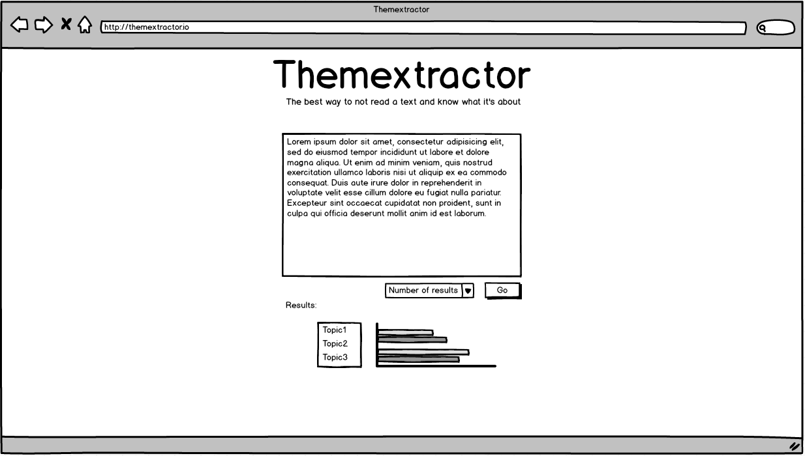

# Themextractor

## What should do Themextractor?
This WebApp can be resumed in a couple simple user stories:
* As a User, I want to input a small text so I can have
the themes/topics this text is about.
* As a User, I want to be able to specify the # number of
topics I want so I can have only the # more relevant ones.

## A simple user interface
The wanted user interface is pretty straightforward:
* A text area in which the user should input the text
he wants to be analyzed.
* A selectbox with the number of topics the user wants.
* A list for the results
* A small bar chart with the different topics and their
confidence score.

Here's a mockup:

## The server side API
The server must provide a simple one call REST API in order
to return the topics of the user inputed text. Any framework
can be used. (I plan to use Sinatra as Rails
  sounds a bit overkill)

## The client
The server must provide a simple MVC application doing the
API consumption and the UI using any framework.
(I planning using none as there's only one REST call and I can do my
own MVC in a shorter time.)

## Text categorizing
The text analysis must be done using the Text Razor API for
the named entity recognition and dbpedia for the topics
identification.

### Named entity recognition
The Textrazor REST API has one simple call to whom you give a text and it returns a response object.
This one 
